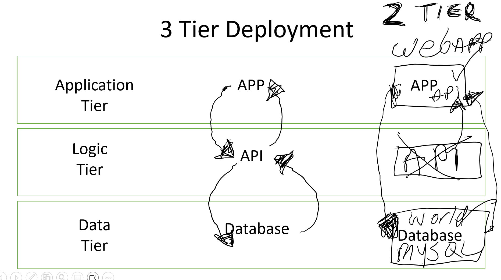

# 2 Tier Deployment Using MySQL world DB and Spring API

## 2 Tier Deployment




As you can see from the image above. A 3 tier deployment usually consists of 3 Layers:
 
 1. Data Layer - Where the data or database is deployed
 2. Logic Layer - Where the Api or business logic would be deployed
    - This would communicate with the database and the application to retrieve the requested data
 3. Application Layer - Where the Application would be deployed   
    - for user interaction to request and interact with the data.


In this Project I deployed a 2 Tier project where the application and api were all in one Spring API app. 
The database itself was a MySQL database which was deployed on a separate VM. This meant that I had to configure both the Application Tier and the Data Tier on two individual Virtual Machines (EC2 Instances).

The Database VM needed to be configured first as I needed to reference the private IP address of the DB VM within the App VM. This was so that the App VM could connect to the Database on the DB VM.

## How To Deploy a 2 Tier Application

### Setting up the Database VM

1. First we need to deploy the DB VM,
   - Launch an EC2 Instance using the following Details:
     - Ubuntu 22.04 LTS, amd64 jammy image build, AMI ID = ami-0905a3c97561e0b69,
     - Instance Type needs to be t2.micro.
     - Create a new Security Group to allow MySQL on port 3306 and SSH port 22 (we will remove this SSH rule once we have finished setting up the DB VM).
   - Now Launch the VM and SSH in.
   - Once Connected to the VM, Run the following commands one at a time to make sure they have the desired effect:
    
```
#!/bin/bash

#update
echo -e "\x1b[32mUpdating Lists...\x1b[0m"
echo " "
sudo apt update -y
echo -e "\x1b[32mDone...\x1b[0m"
echo " "

#upgrade
echo -e "\x1b[32mUpgrading Packages...\x1b[0m"
echo " "
sudo DEBIAN_FRONTEND=noninteractive apt upgrade -y
echo -e "\x1b[32mDone...\x1b[0m"
echo " "

#install MySql server
echo -e "\x1b[32mInstalling MySql Server...\x1b[0m"
echo " "
sudo DEBIAN_FRONTEND=noninteractive apt install mysql-server -y
echo -e "\x1b[32mDone...\x1b[0m"
echo " "

#start enable and check status
echo -e "\x1b[32mStarting Service, Checking Status...\x1b[0m"
echo " "
sudo systemctl is-active --quiet mysql || sudo systemctl start mysql sudo systemctl is-enabled --quiet mysql || sudo systemctl enable mysql
echo -e "\x1b[32mStarted and Enabled...\x1b[0m"
echo " "

#download world.sql
echo -e "\x1b[32mSaving File...\x1b[0m"
git clone https://github.com/CraigWoodcock/worldsql.git
echo -e "\x1b[32mFile Saved...\x1b[0m"
echo " "


# Run world.sql script


echo "Executing Script"
sudo mysql < worldsql/world.sql

echo "Script Executed... "


#set bind address

echo "Set Bind IP..."

sudo sed -i 's/^bind-address\s*=.*/bind-address = 0.0.0.0/' /etc/mysql/mysql.conf.d/mysqld.cnf
echo "Done...."

echo "Revoking Privileges..."
sudo mysql -e "REVOKE ALL PRIVILEGES ON *.* FROM 'root'@'%'; FLUSH PRIVILEGES;"
echo "Dropping User..."
sudo mysql -e "DROP USER IF EXISTS 'root'@'%';"
echo "creating user..."
sudo mysql -e "CREATE USER 'root'@'%' IDENTIFIED BY 'root';"
echo "Granting Privileges..."
sudo mysql -e "GRANT ALL PRIVILEGES ON *.* TO 'root'@'%';"
echo "Grant Options..."
sudo mysql -e "GRANT GRANT OPTION ON *.* TO 'root'@'%';" 
echo "Flushing Privileges..."
sudo mysql -e "FLUSH PRIVILEGES;"
echo "Done..."


echo "Restarting MySQL..."
sudo systemctl restart mysql
echo "Done..."
echo " "

echo "made it to the end.... " 


```

2. Once the Commands have been Executed correctly and the DB VM is running, we can create an AMI of the EC2 Instance. This is because all of the dependencies are now installed and the VM will function as intended on its next Launch as the SQL server was 'enabled'.
   - Create an AMI of this VM and then Launch the AMi, Keep a note of the Private IP.

### Setting up the Application VM

1. Launch a new instance using the same settings as above except for the Instance Type and Security Group. These need to be:
   - Instance Type can be t2.small
   - Security group needs to allow SSH :22, MySQL :3306, and HTTP :80
   - Launch the instance and run the following commands one at a time:
     - Replacing 'DB_HOST' and 'DB_IP' with the Private IP of the DB VM.  
```
#!/bin/bash

#update
echo "Updating Lists..."
echo " "
sudo apt update -y
echo -e "\x1b[32mDone...\x1b[0m"
echo " "

#upgrade
echo "Upgrading Lists..."
echo " "
sudo DEBIAN_FRONTEND=noninteractive apt upgrade -y
echo -e "\x1b[32mDone...\x1b[0m"
echo " "

# install maven
echo "Installing Maven..."
echo " "
sudo DEBIAN_FRONTEND=noninteractive apt install maven -y
echo -e "\x1b[32mMaven Installed...\x1b[0m"
echo " "

#check maven is installed
echo "Check Version Maven..."
echo " "
mvn -v
echo -e "\x1b[32mDone...\x1b[0m"
echo " "

#install jdk java 17
echo "Installing Java 17..."
echo " "
sudo DEBIAN_FRONTEND=noninteractive apt install openjdk-17-jdk -y
echo -e "\x1b[32mJava Installed...\x1b[0m"
echo " "

#check java is installed
echo "Checking Java Version..."
echo " "
java -version
echo -e "\x1b[32mDone...\x1b[0m"
echo " "

#install MySql server
echo -e "\x1b[32mInstalling MySql Server...\x1b[0m"
echo " "
sudo DEBIAN_FRONTEND=noninteractive apt install mysql-server -y
echo -e "\x1b[32mDone...\x1b[0m"
echo " "

#start enable and check status
echo -e "\x1b[32mStarting Service, Checking Status...\x1b[0m"
echo " "
sudo systemctl is-active --quiet mysql || sudo systemctl start mysql sudo systemctl is-enabled --quiet mysql || sudo systemctl enable mysql
echo -e "\x1b[32mStarted and Enabled...\x1b[0m"
echo " "

#restart mysql server
echo -e "\x1b[32mRestarting Service...\x1b[0m"
sudo systemctl restart mysql
echo -e "\x1b[32mDone...\x1b[0m"
echo " "

#copy app code to this vm
echo "Cloning files from git..."
echo " "
git clone https://github.com/CraigWoodcock/tech242-worldproject.git repo 
echo -e "\x1b[32mDone...\x1b[0m"
echo " "

#set env variables
echo "Setting ENV Variables"
export DB_HOST=jdbc:mysql://172.31.39.44:3306/world
export DB_USER=root
export DB_PASS=root
export DB_IP=172.31.39.44
export DB_NAME=world
export MYSQL_PWD=root

echo -e "\x1b[32m$DB_HOST\x1b[0m"
echo -e "\x1b[32m$DB_USER\x1b[0m"
echo -e "\x1b[32m$DB_PASS\x1b[0m"
echo -e "\x1b[32mDone...\x1b[0m"


#install apache web server
echo "Installing Apache web Server..."
echo " "
sudo DEBIAN_FRONTEND=noninteractive apt install apache2  -y
echo -e "\x1b[32mApache Installed...\x1b[0m"
echo " "

#start apache
echo "starting apache & Enabling apache..."
sudo DEBIAN_FRONTEND=noninteractive systemctl start apache2
sudo DEBIAN_FRONTEND=noninteractive systemctl enable apache2
echo -e "\x1b[32mApache Enabled...\x1b[0m"
echo ""

# Enable Apache modules proxy and http
echo "Enabling Modules"
sudo a2enmod proxy
sudo a2enmod proxy_http
echo -e "\x1b[32mDone...\x1b[0m"

#Configure VirtualHost Config

if grep -q 'ProxyPass / http://localhost:5000/' /etc/apache2/sites-available/000-default.conf; then
    # The string exists, so nothing to do
    echo "Reverse proxy already configured."
else
    # reverse proxy not configured yet
	echo "configuring reverse proxy"
    sudo sed -i '/DocumentRoot \/var\/www\/html/ a\ ProxyPreserveHost On\nProxyPass \/ http:\/\/localhost:5000\/\nProxyPassReverse \/ http:\/\/localhost:5000\/\n' /etc/apache2/sites-available/000-default.conf
fi


# Restart Apache
echo "Restarting apache"
sudo systemctl restart apache2
echo -e "\x1b[32mDone...\x1b[0m"
echo " "


# Check if connection to the database can be established
if mysql -u"$DB_USER" -h"$DB_IP" -e "use $DB_NAME"; then
    echo "Connected to the database. Starting the application..."
   #change directory to repo
    echo "Changing Directory"
    cd repo
    sudo -E mvn package spring-boot:start
else
    echo "Failed to connect to the database. Application start aborted."
fi


``` 

2. Create an AMI from this instance.
   - When launching the AMI we need to use the following user data script:
   - Replacing 'DB_HOST' and 'DB_IP' with the Private IP of the DB VM. 

```
#!/bin/bash


#set env variables
echo "Setting ENV Variables"
export DB_HOST=jdbc:mysql://172.31.57.110:3306/world
export DB_USER=root
export DB_PASS=root
export DB_IP=172.31.57.110
export DB_NAME=world
export MYSQL_PWD=root


# Check if connection to the database can be established
if mysql -u"$DB_USER" -h"$DB_IP" -e "use $DB_NAME"; then
    echo "Connected to the database. Starting the application..."
   #change directory to repo
    echo "Changing Directory"
    cd /repo
    sudo -E mvn package spring-boot:start
else
    echo "Failed to connect to the database. Application start aborted."
fi
```

3. Go to the Public IP of the App VM /city to see the app working:


[2 Tier Deployment Scripts](<../Two Tier World Project Scripts>)