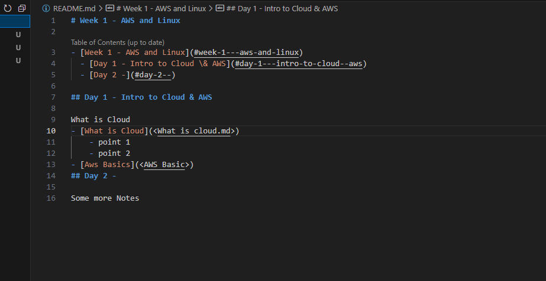

- [Week 1 - AWS and Linux](#week-1---aws-and-linux)
  - [Day 1 - Intro to Cloud \& AWS](#day-1---intro-to-cloud--aws)
  - [Day 2 - EC2 Instances \& Linux Commands](#day-2---ec2-instances--linux-commands)
  - [Day 3 - Scripts, Variables, Processes and Permissions](#day-3---scripts-variables-processes-and-permissions)
  - [Day 4 - Deploying Web App](#day-4---deploying-web-app)
  - [Day 5 - 1 Tier Deployment using AWS EC2 Instance](#day-5---1-tier-deployment-using-aws-ec2-instance)
- [Week 2 - 2 Tier Deployment](#week-2---2-tier-deployment)
  - [2 Tier Deployment](#2-tier-deployment)


# Week 1 - AWS and Linux
## Day 1 - Intro to Cloud & AWS

What is Cloud
- [What Is Cloud?](<Week 1/Day 1/What-is-Cloud>)
    
    - Cloud Basics
    - Benefits Of Cloud
    - Summary

AWS Basics
- [AWS Basics](<Week 1/Day 1/AWS-Basics>)
    - What is AWS?
    - AWS Basics 


## Day 2 - EC2 Instances & Linux Commands

Creating an Instance
- [Creating an Instance](<Week 1/Day 2/AWS-EC2-Instance/Creating-an-EC2-Instance>)
    - How to create a EC2 Instance (VM)

Connecting To an Instance   
- [Connecting To An Instance](<Week 1/Day 2/AWS-EC2-Instance/Connecting to an Instance>)
    - How to connect to the Instance (VM)

Linux Commands  
- [Linux Commands](<Week 1/Day 2/Linux Commands>)
    - Directory Commands
    - Linux Commands
    - Important Points 


## Day 3 - Scripts, Variables, Processes and Permissions
Scripts
- [Scripts](<Week 1/Day 3/Scripts>)
  - How to make a script 

Environment Variables
- [Environment Variables](<Week 1/Day 3/Environment Variables>)
  - What are Environment Variables 

Managing Processes  
- [Managing Processes](<Week 1/Day 3/Managing Processes>)
  - Managing Processes
  - Viewing Processes

Managing Permissions
- [File Ownership and Permissions](<Week 1/Day 3/File Ownership and Permissions>)

## Day 4 - Deploying Web App
Deploying Web App
- [Deploying Web App](<Week 1/Day 4/Deploying Web App>)
  - Creating Security Group
  - Deploying Web App
  - Automating Install Tasks  
- [Copying Files](<Week 1/Day 4/Copying Files>)
  - Copying from local to VM
  - Copying from remote to VM 

## Day 5 - 1 Tier Deployment using AWS EC2 Instance
- [1 Tier Deployment](<Week 1/Day 5/1 Tier Deployment>)
  - 1 Tier Deployment
  - Full steps to deploy an app using an ami
  - Automated Script File

- [Levels Of Automation](<Week 1/Day 5/Levels of Automation>)
  - Automation Levels
  - AMI Level 

- [AMI Automation](<Week 1/Day 5/AMI Automation>)
  - AMI Level
  - Steps To Automate Using AMI

- [Apache Reverse Proxy](<Week 1/Day 5/Apache Reverse Proxy>)
  - Reverse Proxy Script

# Week 2 - 2 Tier Deployment
## 2 Tier Deployment
- [2 Tier Deployment](<Week 2/2 Tier Deployment>)
  - 2 Tier Deployment
  
- [APP VM Script](<Week 2/App VM>)
  - Application Tier VM Script
  - Current Status/Issues 

- [DB VM Script](<Week 2/DB VM>)
  - Application Tier VM Script
  - Current Status/Issues 
<!--   -->

<!-- ## How to change directory in Linux

Change directory using this command: `cd <directory>`

Change directory using this command: 
```
cd <directory>
<other commands>

``` -->