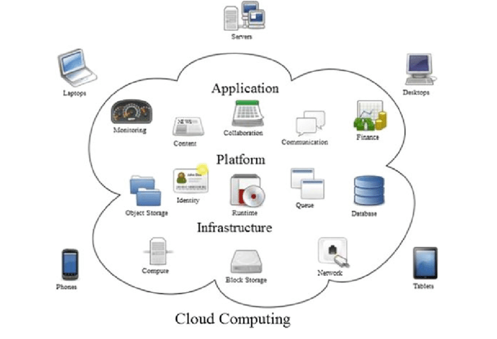
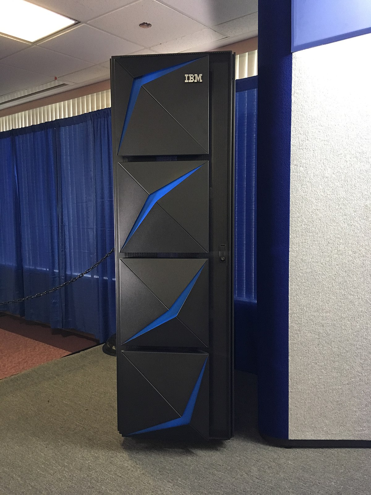

# What Is Cloud?

## What Is Cloud Computing?

Cloud computing is when you store data and access or run applications via the internet rather than keeping them on a personal computer or in an office desk.

The cloud is basically like a giant network of computers, all connected via the internet. You can use the resources on these computers to access your own files such as personal documents, photo's, videos etc. Run software and applications, develop software and even host websites.

Cloud computing is like having your own private server but it is managed by a third-party called a 'Cloud Provider'. Three of the most popular cloud providers include: Amazon Web Services(AWS), Microsoft Azure and Google Cloud Platform(GCP). 

## History of Cloud Computing
- 1950s-1960s: Mainframe Computing is Born
  - Mainframes were huge computers that were situated in large data centres that would be shared by multiple people
  - This concept of shared computing was a precursor to the cloud model as we know it today!

  
- 1960s-1970s

## Benefits of Cloud Computing

- Flexible - you can access cloud resources from anywhere in the world on any device that can obtain an internet connection.
- Cost Effective - With Cloud Computing you only pay for the resources that you use and You dont need to buy hardware or pay maintanence costs for that hardware
- Scalable - You can easily increase the resources you use or decrease them depending on your demands at the time.
- Security - Cloud Computing offers great security protection as Cloud Providers invest heavily in security measures to secure personal data. These providers could be subjected to heavy fines if there is a data breach.

## Summary

The cloud is a powerful and versatile tool, that can be utilised for a wide array of applications. It offers a more flexible, cost-effective and user friendly way to store, access and manage personal data and applications than ever before.

