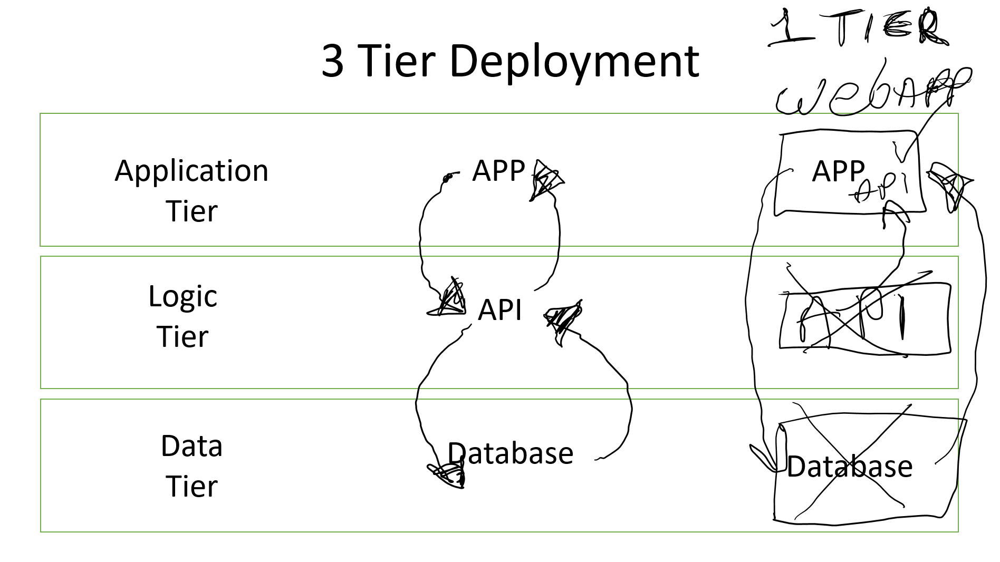

# 1 Tier App Deployment Using AWS and AMI's

## 1 Tier Deployment




As you can see from the image above. A 3 tier deployment usually consists of 3 Tiers:
 
 1. Data Layer - Where the data or database is deployed
 2. Logic Tier - Where the Api or business logic would be deployed
    - This would communicate with the database and the application to retrieve the requested data
 3. Application Tier - Where the Application would be deployed   
    - for user interaction to request and interact with the data.

In our deployment, the application and api were all in one app, The database itself was already deployed. this meant that we had no data tier or logic tier to contend with.

Making this a 1 Tier Deployment


## Full steps to deploy an app using an ami.

- Launch a new instance on AWS using correct credentials.
  - we used t2.micro tier, ubuntu lts 22.04, tech242 key pair and existing security group
  - security group can be modified to allow other types of traffic 
-  SSH into the VM using the link on the `Connect` tab.
-  create a new file using `nano` command.
-  Give file `x` (execute) permissions so that it can be run.
-  Manually run each command, if it works add the command to the script file
-  Once your script is complete, execute it using `./<filename>.sh`
-  if this works then Launch a new instance, create a new `.sh` file and paste in your script contents, change permissions and execute the script.
-  If this works correctly, create a new instance and paste in the script contents into user data and launch the instance.
-  IF this works then you can create an AMI from that instance to speed up deployment.

## Example of working Script With Reverse Proxy
```
#!/bin/bash

#update
echo "Updating Lists..."
echo " "
sudo apt update -y
echo -e "\x1b[32mDone...\x1b[0m"
echo " "

#upgrade
echo "Upgrading Lists..."
echo " "
sudo DEBIAN_FRONTEND=noninteractive apt upgrade -y
echo -e "\x1b[32mDone...\x1b[0m"
echo " "

# install maven
echo "Installing Maven..."
echo " "
sudo DEBIAN_FRONTEND=noninteractive apt install maven -y
echo -e "\x1b[32mMaven Installed...\x1b[0m"
echo " "

#check maven is installed
echo "Check Version Maven..."
echo " "
mvn -v
echo -e "\x1b[32mDone...\x1b[0m"
echo " "

#install jdk java 17
echo "Installing Java 17..."
echo " "
sudo DEBIAN_FRONTEND=noninteractive apt install openjdk-17-jdk -y
echo -e "\x1b[32mJava Installed...\x1b[0m"
echo " "

#check java is installed
echo "Checking Java Version..."
echo " "
java -version
echo -e "\x1b[32mDone...\x1b[0m"
echo " "

#copy app code to this vm
echo "Cloning files from git..."
echo " "
git clone https://github.com/CraigWoodcock/tech242-jsonvoorhees-app.git
echo -e "\x1b[32mDone...\x1b[0m"
echo " "

#install apache web server
echo "Installing Apache web Server..."
echo " "
sudo DEBIAN_FRONTEND=noninteractive apt install apache2  -y
echo -e "\x1b[32mApache Installed...\x1b[0m"
echo " "

#start apache
echo "starting apache & Enabling apache..."
sudo DEBIAN_FRONTEND=noninteractive systemctl start apache2
sudo DEBIAN_FRONTEND=noninteractive systemctl enable apache2
echo -e "\x1b[32mApache Enabled...\x1b[0m"
echo ""

# Enable Apache modules proxy and http
echo "Enabling Modules"
sudo a2enmod proxy
sudo a2enmod proxy_http
echo -e "\x1b[32mDone...\x1b[0m"

#Configure VirtualHost Config

if grep -q 'ProxyPass / http://localhost:5000/' /etc/apache2/sites-available/000-default.conf; then
    # The string exists, so nothing to do
    echo "Reverse proxy already configured."
else
    # reverse proxy not configured yet
    echo "configuring reverse proxy"
    sudo sed -i '/DocumentRoot \/var\/www\/html/ a\ ProxyPreserveHost On\nProxyPass \/ http:\/\/localhost:5000\/\nProxyPassReverse \/ http:\/\/localhost:5000\/\n' /etc/apache2/sites-available/000-default.conf
fi

# Restart Apache
echo "Restarting apache"
sudo systemctl restart apache2
echo -e "\x1b[32mDone...\x1b[0m"
echo " "

#change directory to springapi
echo "Changing Directory..."
echo " "
cd /tech242-jsonvoorhees-app/springapi
echo -e "\x1b[32mDone...\x1b[0m"
echo " "

# Stop Spring Boot App
echo "Stopping Spring App..."
echo " "
mvn spring-boot:stop
echo -e "\x1b[32mDone...\x1b[0m"
echo " "

#start Spring Boot App
echo "Starting Spring App..."
echo " "
mvn spring-boot:start
echo -e "\x1b[32mSpring App Started....\x1b[0m"
echo " "
```
