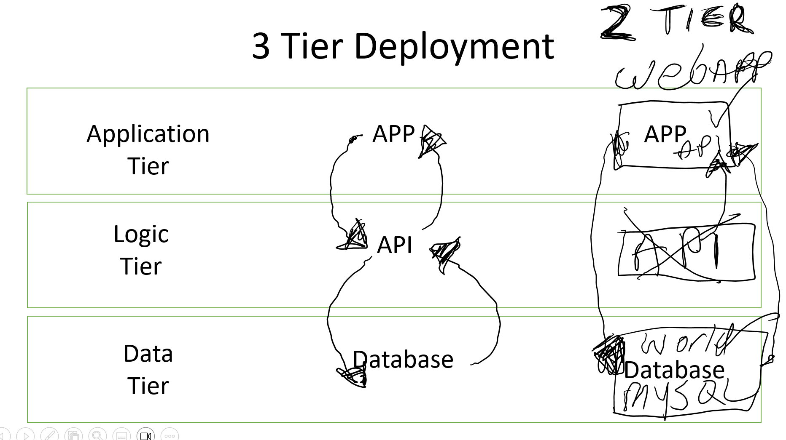

# 2 Tier Deployment Using MySQL world DB and Spring API

## 2 Tier Deployment

As you can see from the image above. A 3 tier deployment usually consists of 3 Tiers:
 
 1. Data Layer - Where the data or database is deployed
 2. Logic Tier - Where the Api or business logic would be deployed
    - This would communicate with the database and the application to retrieve the requested data
 3. Application Tier - Where the Application would be deployed   
    - for user interaction to request and interact with the data.

In this deployment, the application and api were all in one Spring API app. 
The database itself was a MySQL database wich was deployed on a seperate VM. this meant that we had to configure both the Application Tier and the Data Tier

Making this a 2 Tier Deployment